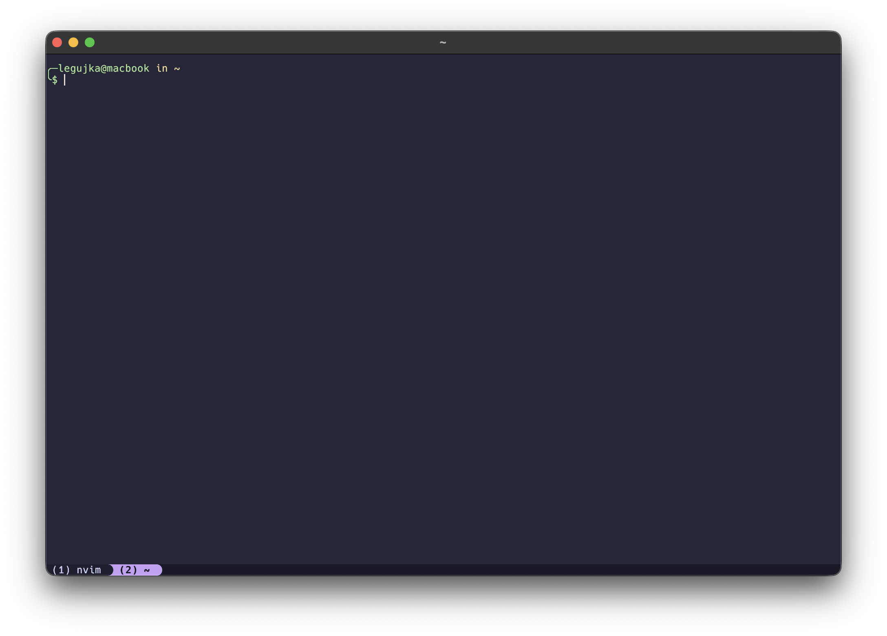
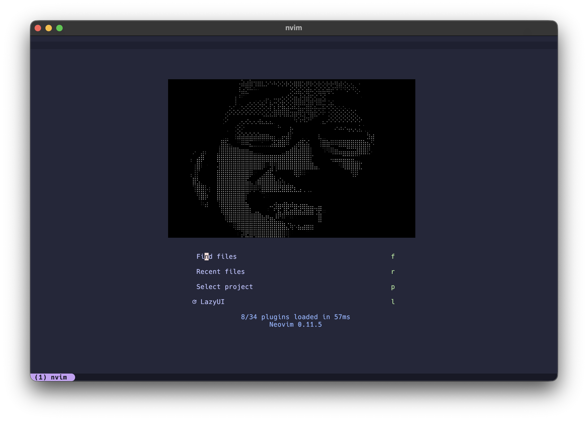

# DOTFILES


## Preview

| Terminal | Neovim |
|----------|--------|
|  |  |


> Theme for kitty and nvim - [Catppuccin Macchiato](https://catppuccin.com)

---

## Overview

My custom dotfiles repository for go-based development

**P.S. R He Hecy oTBeTcTBeHHocTb, eclN y Bac 4To-To ZDoxHeT**

---

## Features

- Single theme over all tools: [Catppuccin Macchiato](https://catppuccin.com)
- Vi-mode keybindings everywhere(nvim, zsh, btop, lazygit)
- Go-focused: comprehensive LSP, snippets, and DAP debugging
- Terminal level bracket remapping:
    - Key `[` using for `[` and `<S>-[` for `]`
    - Key `]` using for `{` and `<S>-]` for `}`
    > To use brackets without excess finger movements

---

## Dependencies

- git
- zsh
- omz - [Oh My Zsh](https://ohmyz.sh)
- go[1.25+]
- kitty[0.45.0]
- nvim[0.11+]

### ZSH Plugins

- [zsh-autosuggestions](https://github.com/zsh-users/zsh-autosuggestions)
- [zsh-syntax-highlighting](https://github.com/zsh-users/zsh-syntax-highlighting.git)

### Core Utilities

- ripgrep - For neovim Telescope
- fzf - For zsh fuzzy finder
- bat, tree - For fzf
- zoxide (optional) - If installed, `cd` is aliased to zoxide in `.zshrc`
- eza (optional) - If installed, `ls` aliased to eza in `.zshrc`
- btop - pretty top alternative

### LSP Servers

- gopls - Go language server
- lua-language-server - Lua LSP
- yaml-language-server - YAML LSP (requires Node.js)
- dockerfile-language-server-nodejs - Docker LSP (requires Node.js)
- bufls - Protocol Buffers LSP
- helm-ls - Helm LSP

### Linters

- golangci-lint - Go linter
- hadolint - Dockerfile linter

### Fonts

- Hack Nerd Font Mono - Required for Kitty terminal icons

### Go Tools

- dlv - Go debugger (for nvim-dap)
- buf - Protocol Buffers tooling
- mockery - Mock generator
- lazygit - Terminal UI for git

### MacOS

- yabai - window tile manager
- borders - borders setup for yabai
- sdhk - keymaps for yabai

### Optional

- Node.js & npm - For some LSP servers
- Docker - For Docker completions and dockerls
- Helm - For helm_ls
- Fastfetch - For terminal startup and system info preview

---

## Getting Started

1. Ensure you have installed dependencies for correct experience 
2. Run `./setup.sh` to link configuration files from `./home` to your home directory `~`
    ```sh
    # Run from dotfiles repository folder
    ./setup.sh
    ```
3. Optionally `./scripts/install_go_deps.sh` - to install go tools:
    - [dlv v1.26.0](https://github.com/go-delve/delve)
    - [buf v1.62.1](https://github.com/bufbuild/buf)
    - [mockery v3.6.1](https://github.com/vektra/mockery)
    - [golangci-lint v2.8.0](https://github.com/golangci/golangci-lint)
    - [lazygit latest](https://github.com/jesseduffield/lazygit)
    - [gopls latest](https://golang.org/x/tools/gopls)


### `./setup.sh` details:

- Script creates symlinks from `./home` directory to `~`
- If files/dirs already exist, the script creates backups: `{filename}.backup.Ymd_HMS`
- Rerunning the script on already created symlinks does not recreate them if they already point to the correct location
- Creates parent directories if they don't exist
    - Example: `./home/.config/nvim` creates `~/.config/` if needed


**To undo changes, remove links created by the script from `~` and rename backup files without `.backup.Ymd_HMS`**

---

## TODO:

- [ ] Add neovim paragraph in the README.md
- [ ] Add [persistence.nvim](https://github.com/folke/persistence.nvim) plugin
- [ ] Add info about `./home/.local/scripts`
- [x] OS specific configs: `OSX_CONFIGS` in `./setup.sh`

---

## License

This project is licensed under the [MIT license](LICENSE)
